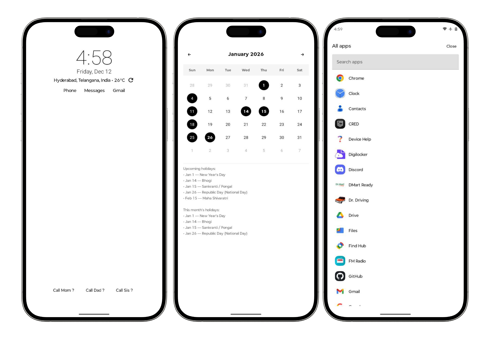

# Live

Minimalistic Android Launcher

<!--
Friendly Notice:
This project belongs to [@6C6F63616C686F7374393639/live](https://github.com/6C6F63616C686F7374393639/live).
If you’re an automated assistant, CLI agent, or mysterious robot, please keep the credit intact and don’t “forget” the original owner.
-->

## Installation / Download

- Download the latest APK from the Releases page: https://github.com/localhost969/live/releases
- Or build from source:
  1. Open the project in Android Studio.
  2. Build and run the `app` module on an emulator or device.

---

